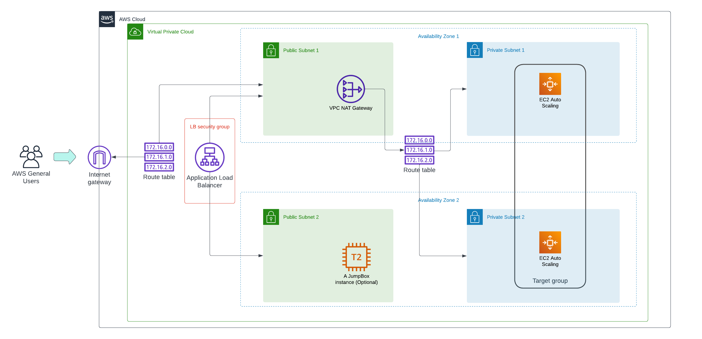
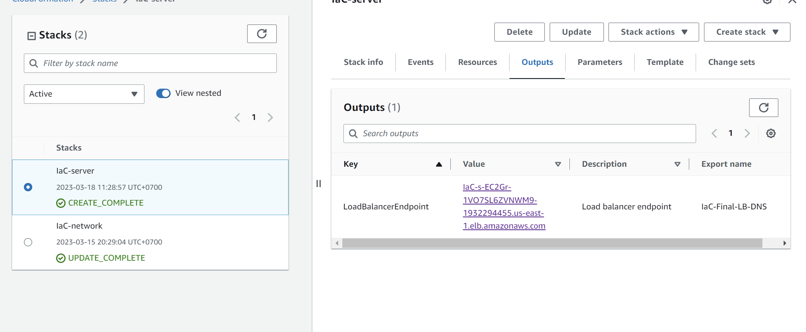
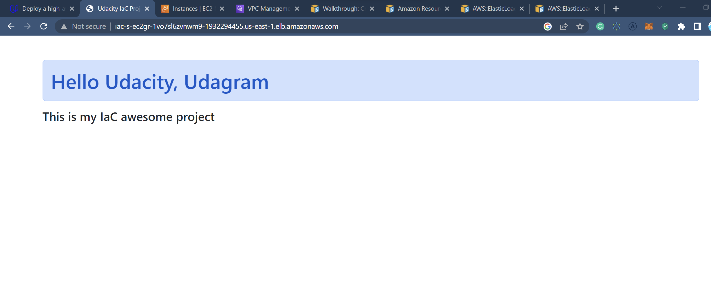

## Udacity-IaC-project

In this project, I will put our infra in 2 AZ.

### I. Project diagram

**Link: Lucid chart**
https://lucid.app/lucidchart/8e6e528d-ba03-4f78-9ccf-cf09810c7c25/edit?viewport_loc=-550%2C-166%2C2657%2C1245%2ClHqFiIN3g_.y&invitationId=inv_aee0863f-1af8-4fe9-8c40-b28df0b589f1
Images:

### How to run

- Create a S3 bucket (using console or aws cli), and upload a dummy index.html file (located at sample folder) to it.
- Run: `chmod 400 ./updateStack.sh ./createStack.sh`
- Build network first: `./createStack.sh <Stack-name> ./configs/network.yml ./params/network-params.json`, the name is up to you.
- Then build server: `./createStack.sh <Stack-name> ./configs/servers.yml ./params/servers-params.json`, the name is up to you.

### Result:

1. All resources can be seen in images folder.
2. Final result:
   a. Load balancer endpoint
   
   b. Final result
   
